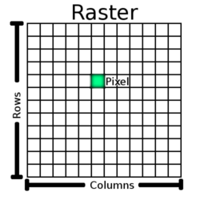

# README #

## Micro Computer Vision Library C++##
This library ain't no OpenCv, but it can do the following operations fast:
* Read and write jpeg, png and tiff images
* Crop the image
* Convert RGB images to grayscale and viceversa
* Edge detection with the [Sobel Operator](https://en.wikipedia.org/wiki/Sobel_operator).

It is written in C++11. It uses the [boost::gil](https://www.boost.org/doc/libs/release/libs/gil/) library for file I/O (which in turn uses libjpeg, libpng and libtiff), but the dependency on GIL is encapsulated within FileIo.cpp and it can easily be replaced with OpenCV or libjpeg.


## Build Instructions ##
Only Linux is supported for now:

### Linux ###
Install depedendecies: libpng, libjpeg, libtiff, boost, cmake and git

On ubuntu:
```
sudo apt-get install libpng12-dev libjpeg-dev libtiff5-dev libboost-all-dev cmake git
mkdir build
cd build
cmake ..
make
# run one of the sample programs
./microcv_sobel_edges --in_file "file1" --out_file "file2"
```

## Unit Tests ##
Unit tests are built automatically - during the process the laters googletest master will be checked
automatically from GitHub and built in place. Following that the unit tests can be run with:

`./test_microcv`

The googletest cmake script is based on the following GitHub repo - [google-test-examples](https://github.com/snikulov/google-test-examples/).


## Tech Details ##

### MicroCv::Mat ###

The MicroCv library is based on the MicroCv::Mat class - it is a simple container for a pixel raster. 



In a raster the data is laid out in one continous buffer and a pixel at location (x, y) can be accessed using the following formula:
```
pixel_offset = y*numberOfColumns + x
pixel = raster[pixel_offset]
```

The pixels are stored as unsigned char (uint8_t) pixels in an std::vector. MicroCv::Mat provides access to this vector and to the pointers of the data - care must be taken not to exceed memory bounds (the last pixel will be in data[mat.width()\*mat.height()\*mat.channels()-1].

MicroCv::Mat works in two modes RGB and grayscale when in RGB each pixel will have the RGB values stored in 3 consecutive bytes, and in grayscale mode consecutive bytes will refer to adjacent pixels. 

### Image Processing ###
The following image processing functions are currently available:
* Cropping a matrix
* RGB to Gray and vice-versa
* [Sobel Edge Detector](https://en.wikipedia.org/wiki/Sobel_operator)

## Precompiled binaries ##
Precompiled x86_64 binaries are available in the bin directory, each of these performs a simple image processing function from the command line
* bin/microcv_crop
* bin/microcv_rgb2gray
* bin/microcv_sobel_edges
* bin/test_microcv (compiled unit tests)


## Using MicroCv as a C++ library ##
The library libmicrocv.a can be recompiled or taken from bin/ and then new C++ code can link against it:

`g++ -o some_other_program other_cpp_files.cpp -I/path/to/microcv/include -L/path/to/libmicrocv -lmicrocv`
